# Integración de Google Calendar - Documentación Técnica

## 📖 Resumen

Esta documentación describe la implementación completa de la integración bidireccional entre FocusOnIt y Google Calendar.

## 🏗️ Arquitectura

### Componentes Principales

```
task-manager/
├── app/api/calendar/              # API Routes
│   ├── connect/route.ts           # Iniciar OAuth
│   ├── oauth/callback/route.ts    # OAuth callback
│   ├── disconnect/route.ts        # Desconectar
│   ├── status/route.ts            # Estado de conexión
│   ├── sync/route.ts              # Sincronizar tareas
│   ├── import/route.ts            # Importar eventos
│   └── delete-event/route.ts      # Eliminar evento
├── lib/
│   ├── google-calendar/
│   │   ├── oauth.ts               # Utilidades OAuth
│   │   └── sync.ts                # Servicios de sincronización
│   ├── hooks/
│   │   └── useGoogleCalendarSync.ts  # Hook React
│   └── utils/
│       └── calendarSync.ts        # Helpers de sincronización
├── components/
│   ├── settings/
│   │   └── GoogleCalendarIntegration.tsx  # UI principal
│   └── CalendarSyncIndicator.tsx  # Indicador de estado
└── supabase/migrations/
    └── create_google_calendar_tokens.sql  # Schema DB
```

## 🔄 Flujos de Trabajo

### 1. Autenticación OAuth

```mermaid
graph LR
    A[Usuario] --> B[Clic en Conectar]
    B --> C[GET /api/calendar/connect]
    C --> D[Generar Auth URL]
    D --> E[Redirigir a Google]
    E --> F[Usuario autoriza]
    F --> G[GET /api/calendar/oauth/callback]
    G --> H[Intercambiar código por tokens]
    H --> I[Guardar tokens en DB]
    I --> J[Redirigir a Settings]
```



### 2. Sincronización de Tarea

```mermaid
graph TD
    A[Usuario crea/edita tarea] --> B{¿google_calendar_sync?}
    B -->|No| C[Solo guardar en DB]
    B -->|Sí| D[Guardar en DB]
    D --> E{¿Tiene google_event_id?}
    E -->|No| F[Crear evento en Calendar]
    E -->|Sí| G[Actualizar evento en Calendar]
    F --> H[Guardar event_id en tarea]
    G --> I[Actualizar last_synced_at]
    H --> I
```



### 3. Importación de Eventos

```mermaid
graph LR
    A[Usuario] --> B[Clic en Importar]
    B --> C[POST /api/calendar/import]
    C --> D[Listar eventos de Calendar]
    D --> E{Por cada evento}
    E --> F{¿Ya existe?}
    F -->|No| G[Crear tarea en DB]
    F -->|Sí| E
    G --> H[Guardar google_event_id]
    H --> E
    E --> I[Retornar conteo]
```



## 🗄️ Modelo de Datos

### Tabla: google_calendar_tokens

```sql
CREATE TABLE google_calendar_tokens (
  id UUID PRIMARY KEY DEFAULT gen_random_uuid(),
  user_id UUID NOT NULL REFERENCES auth.users(id) ON DELETE CASCADE,
  access_token TEXT NOT NULL,
  refresh_token TEXT NOT NULL,
  token_expiry TIMESTAMPTZ NOT NULL,
  scope TEXT NOT NULL,
  calendar_id TEXT DEFAULT 'primary',
  created_at TIMESTAMPTZ DEFAULT NOW(),
  updated_at TIMESTAMPTZ DEFAULT NOW(),
  UNIQUE(user_id)
);
```

### Tabla: tasks (campos relevantes)

```sql
-- Campos existentes en la tabla tasks
google_event_id TEXT,              -- ID del evento en Google Calendar
synced_with_calendar BOOLEAN,      -- Estado de sincronización
google_calendar_sync BOOLEAN,      -- Habilitar/deshabilitar sync
last_synced_at TIMESTAMPTZ,        -- Timestamp de última sincronización
```

## 🔌 API Endpoints

### Autenticación

#### GET /api/calendar/connect

Genera la URL de autorización OAuth de Google.

**Response**:
```json
{
  "success": true,
  "authUrl": "https://accounts.google.com/o/oauth2/v2/auth?..."
}
```

#### GET /api/calendar/oauth/callback

Callback de OAuth. Intercambia el código de autorización por tokens.

**Query Parameters**:
- `code`: Código de autorización de Google
- `state`: Estado de seguridad (user_id)

**Redirect**: `/settings?calendar_connected=true`

#### POST /api/calendar/disconnect

Desconecta Google Calendar del usuario.

**Response**:
```json
{
  "success": true,
  "message": "Google Calendar disconnected successfully"
}
```

#### GET /api/calendar/status

Verifica si el usuario tiene Google Calendar conectado.

**Response**:
```json
{
  "success": true,
  "connected": true
}
```

### Sincronización

#### POST /api/calendar/sync

Sincroniza una o más tareas con Google Calendar.

**Request Body (tarea individual)**:
```json
{
  "task": {
    "id": "uuid",
    "title": "Mi tarea",
    "due_date": "2025-10-25",
    "google_calendar_sync": true
  }
}
```

**Request Body (batch)**:
```json
{
  "taskIds": ["uuid1", "uuid2", "uuid3"]
}
```

**Response**:
```json
{
  "success": true,
  "eventId": "google-event-id",
  "message": "Task synced successfully"
}
```

#### POST /api/calendar/import

Importa eventos de Google Calendar como tareas.

**Request Body**:
```json
{
  "startDate": "2025-10-21T00:00:00Z",
  "endDate": "2025-11-21T00:00:00Z"
}
```

**Response**:
```json
{
  "success": true,
  "count": 15,
  "message": "Successfully imported 15 event(s) from Google Calendar"
}
```

#### POST /api/calendar/delete-event

Elimina un evento de Google Calendar.

**Request Body**:
```json
{
  "task": {
    "id": "uuid",
    "google_event_id": "google-event-id"
  }
}
```

**Response**:
```json
{
  "success": true,
  "message": "Calendar event deleted successfully"
}
```

## 🎨 Componentes React

### GoogleCalendarIntegration

Componente principal para gestionar la conexión en la página de Settings.

**Uso**:
```tsx
import { GoogleCalendarIntegration } from '@/components/settings/GoogleCalendarIntegration'

<GoogleCalendarIntegration userId={user.id} />
```

**Funcionalidades**:
- Mostrar estado de conexión
- Botón para conectar/desconectar
- Importar eventos
- Sincronizar tareas pendientes

### CalendarSyncIndicator

Indicador visual del estado de sincronización en cada tarea.

**Uso**:
```tsx
import { CalendarSyncIndicator } from '@/components/CalendarSyncIndicator'

<CalendarSyncIndicator
  googleEventId={task.google_event_id}
  syncedWithCalendar={task.synced_with_calendar}
  googleCalendarSync={task.google_calendar_sync}
  size="sm"
  showLabel={false}
/>
```

## 🪝 Hooks Personalizados

### useGoogleCalendarSync

Hook para manejar sincronización desde componentes React.

**Uso**:
```tsx
import { useGoogleCalendarSync } from '@/lib/hooks/useGoogleCalendarSync'

function MyComponent() {
  const { syncing, syncTask, deleteTask, batchSync, importEvents } = useGoogleCalendarSync()

  const handleCreateTask = async (task) => {
    // Crear tarea en DB
    await createTaskInDB(task)

    // Sincronizar con Calendar
    await syncTask(task)
  }

  const handleDeleteTask = async (task) => {
    // Eliminar de Calendar
    await deleteTask(task)

    // Eliminar de DB
    await deleteTaskFromDB(task)
  }

  return (
    // JSX
  )
}
```

## 🛠️ Utilidades

### Funciones de Sincronización

```typescript
import { syncTaskToCalendar, deleteTaskFromCalendar } from '@/lib/utils/calendarSync'

// Sincronizar después de crear/actualizar (fire-and-forget)
await syncTaskToCalendar(task)

// Eliminar después de borrar (fire-and-forget)
await deleteTaskFromCalendar(task)

// Verificar conexión
const connected = await isCalendarConnected()
```

### Funciones OAuth

```typescript
import {
  generateAuthUrl,
  exchangeCodeForTokens,
  storeTokens,
  getAuthenticatedClient,
  deleteTokens,
  isGoogleCalendarConnected
} from '@/lib/google-calendar/oauth'

// Generar URL de autorización
const authUrl = generateAuthUrl(userId)

// Intercambiar código por tokens
const tokens = await exchangeCodeForTokens(code)

// Almacenar tokens
await storeTokens(userId, tokens)

// Obtener cliente autenticado (con renovación automática)
const oauth2Client = await getAuthenticatedClient(userId)

// Eliminar tokens
await deleteTokens(userId)

// Verificar conexión
const connected = await isGoogleCalendarConnected(userId)
```

### Funciones de Sincronización

```typescript
import {
  createCalendarEvent,
  updateCalendarEvent,
  deleteCalendarEvent,
  importCalendarEvents,
  syncTaskToCalendar,
  batchSyncTasks
} from '@/lib/google-calendar/sync'

// Crear evento
const result = await createCalendarEvent(userId, task)

// Actualizar evento
const result = await updateCalendarEvent(userId, task)

// Eliminar evento
const result = await deleteCalendarEvent(userId, task)

// Importar eventos
const result = await importCalendarEvents(userId, startDate, endDate)

// Sincronizar tarea (crea o actualiza según google_event_id)
const result = await syncTaskToCalendar(userId, task)

// Sincronización por lotes
const result = await batchSyncTasks(userId, taskIds)
```

## 🔐 Seguridad

### OAuth 2.0 Flow

1. **Authorization Code Flow**: Flujo estándar OAuth 2.0
2. **State Parameter**: Validación de seguridad contra CSRF
3. **HTTPS Only**: Todas las comunicaciones encriptadas
4. **Token Expiration**: Tokens de acceso con tiempo de vida limitado
5. **Refresh Tokens**: Renovación automática sin re-autorización

### Row Level Security (RLS)

Políticas de Supabase para `google_calendar_tokens`:

```sql
-- Solo el usuario puede ver sus propios tokens
CREATE POLICY "Users can view their own tokens"
  ON google_calendar_tokens FOR SELECT
  USING (auth.uid() = user_id);

-- Solo el usuario puede insertar sus propios tokens
CREATE POLICY "Users can insert their own tokens"
  ON google_calendar_tokens FOR INSERT
  WITH CHECK (auth.uid() = user_id);

-- Solo el usuario puede actualizar sus propios tokens
CREATE POLICY "Users can update their own tokens"
  ON google_calendar_tokens FOR UPDATE
  USING (auth.uid() = user_id);

-- Solo el usuario puede eliminar sus propios tokens
CREATE POLICY "Users can delete their own tokens"
  ON google_calendar_tokens FOR DELETE
  USING (auth.uid() = user_id);
```

### Protección de Endpoints

Todos los endpoints de API verifican autenticación:

```typescript
const supabase = await createClient()
const { data: { user }, error: authError } = await supabase.auth.getUser()

if (authError || !user) {
  return NextResponse.json({ error: 'Unauthorized' }, { status: 401 })
}
```

## 📊 Manejo de Errores

### Estrategia de Reintentos

La sincronización es **fire-and-forget** por defecto para no bloquear la UI:

```typescript
export async function syncTaskToCalendar(task: Task): Promise<void> {
  if (!task.google_calendar_sync) return

  try {
    const response = await fetch('/api/calendar/sync', {
      method: 'POST',
      headers: { 'Content-Type': 'application/json' },
      body: JSON.stringify({ task }),
    })

    if (!response.ok) {
      console.warn('Calendar sync failed:', await response.json())
    }
  } catch (error) {
    console.warn('Calendar sync failed:', error)
  }
}
```

### Renovación Automática de Tokens

```typescript
export async function getAuthenticatedClient(userId: string) {
  const tokens = await getStoredTokens(userId)
  const oauth2Client = getOAuth2Client()

  oauth2Client.setCredentials({
    access_token: tokens.access_token,
    refresh_token: tokens.refresh_token,
    expiry_date: new Date(tokens.token_expiry).getTime(),
  })

  // Renovar si está expirado
  const now = Date.now()
  const expiryTime = new Date(tokens.token_expiry).getTime()

  if (expiryTime <= now) {
    const { credentials } = await oauth2Client.refreshAccessToken()
    oauth2Client.setCredentials(credentials)
    await storeTokens(userId, credentials)
  }

  return oauth2Client
}
```

### Estados de Sincronización

```typescript
interface Task {
  google_event_id?: string | null        // null = no sincronizado, string = sincronizado
  synced_with_calendar?: boolean         // true = sincronizado exitosamente
  google_calendar_sync?: boolean         // true = habilitar sincronización
  last_synced_at?: string | null         // timestamp de última sincronización
}
```

Estados posibles:
- **No configurado**: `google_calendar_sync = false`
- **Pendiente**: `google_calendar_sync = true, synced_with_calendar = false`
- **Sincronizado**: `google_calendar_sync = true, synced_with_calendar = true, google_event_id != null`
- **Error**: `google_calendar_sync = true, synced_with_calendar = false, google_event_id != null`

## 🧪 Testing

### Pruebas Manuales

1. **Conectar Google Calendar**
   - [ ] Hacer clic en "Conectar con Google"
   - [ ] Autorizar en Google OAuth
   - [ ] Verificar redirección exitosa
   - [ ] Confirmar estado "Conectado"

2. **Crear Tarea con Sincronización**
   - [ ] Crear tarea con fecha
   - [ ] Verificar evento en Google Calendar
   - [ ] Confirmar google_event_id guardado

3. **Editar Tarea Sincronizada**
   - [ ] Editar título de tarea
   - [ ] Verificar actualización en Google Calendar
   - [ ] Editar fecha de tarea
   - [ ] Verificar actualización en Google Calendar

4. **Eliminar Tarea Sincronizada**
   - [ ] Eliminar tarea
   - [ ] Verificar eliminación en Google Calendar

5. **Importar Eventos**
   - [ ] Crear eventos en Google Calendar
   - [ ] Hacer clic en "Importar eventos"
   - [ ] Verificar creación de tareas en FocusOnIt

6. **Desconectar Google Calendar**
   - [ ] Hacer clic en "Desconectar"
   - [ ] Confirmar desconexión
   - [ ] Verificar que tareas no se eliminen

### Pruebas de Edge Cases

- [ ] Token expirado (esperar 1 hora)
- [ ] Sin conexión a internet
- [ ] Tarea sin fecha
- [ ] Evento todo el día
- [ ] Múltiples tareas simultáneas
- [ ] Importar eventos duplicados

## 📈 Performance

### Optimizaciones

1. **Batch Operations**: Sincronizar múltiples tareas en una sola llamada
2. **Fire-and-Forget**: Sincronización asíncrona no bloquea UI
3. **Token Caching**: Cliente OAuth reutilizado durante sesión
4. **Lazy Loading**: Componente de integración solo en Settings

### Límites de API

- Google Calendar API: 1,000,000 queries/día
- 100 queries/usuario/segundo
- Implementar rate limiting si es necesario

## 🚀 Deployment

### Variables de Entorno

**Development**:
```bash
GOOGLE_CLIENT_ID=xxx.apps.googleusercontent.com
GOOGLE_CLIENT_SECRET=xxx
GOOGLE_REDIRECT_URI=http://localhost:3000/api/calendar/oauth/callback
NEXTAUTH_SECRET=xxx
```

**Production**:
```bash
GOOGLE_CLIENT_ID=xxx.apps.googleusercontent.com
GOOGLE_CLIENT_SECRET=xxx
GOOGLE_REDIRECT_URI=https://yourdomain.com/api/calendar/oauth/callback
NEXTAUTH_SECRET=xxx
```

### Checklist de Deployment

- [ ] Credenciales OAuth en Google Cloud Console
- [ ] Variables de entorno configuradas
- [ ] Migración de DB ejecutada
- [ ] URI de redirección actualizada para producción
- [ ] Verificación de aplicación en Google (si es necesario)

## 📝 Próximas Mejoras

### Sincronización Bidireccional Completa

Implementar webhooks de Google Calendar para detectar cambios:

1. Configurar Google Calendar Push Notifications
2. Crear endpoint `/api/webhooks/google-calendar`
3. Verificar firma de webhook
4. Actualizar tareas cuando cambien eventos

### Sincronización Selectiva por Calendario

Permitir seleccionar qué calendario de Google usar:

```typescript
interface GoogleCalendarTokens {
  calendar_id: string  // 'primary' o ID específico
}
```

### Sincronización de Recordatorios

Mapear recordatorios de FocusOnIt a Google Calendar:

```typescript
event.reminders = {
  useDefault: false,
  overrides: [
    { method: 'popup', minutes: minutesBefore }
  ]
}
```

### Queue de Sincronización

Para manejar fallos y reintentos:

1. Tabla `sync_queue` en Supabase
2. Worker que procese cola periódicamente
3. Estados: pending, processing, completed, failed

## 🤝 Contribuciones

Para contribuir a esta integración:

1. Familiarízate con el código existente
2. Sigue las convenciones de código del proyecto
3. Añade tests para nuevas funcionalidades
4. Actualiza documentación según sea necesario

---

**Documentación completa disponible en**: [GOOGLE_CALENDAR_SETUP.md](./GOOGLE_CALENDAR_SETUP.md)
