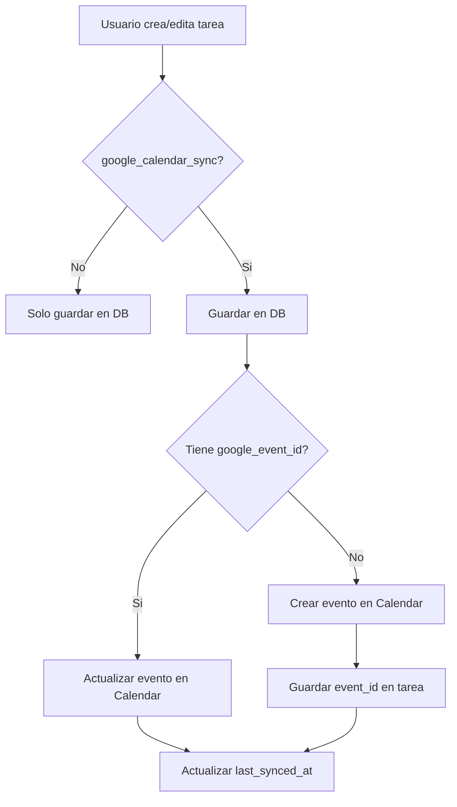
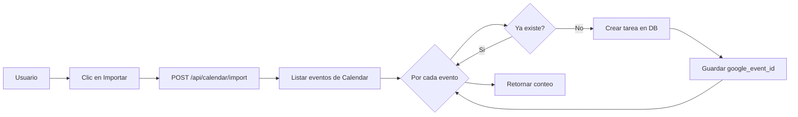

# Integracion de Google Calendar - Documentacion Tecnica

## Resumen

Esta documentacion describe la implementacion completa de la integracion bidireccional entre FocusOnIt y Google Calendar, incluyendo la autenticacion con Google OAuth.

## Arquitectura

### Componentes Principales

```
task-manager/
├── app/api/calendar/              # API Routes
│   ├── connect/route.ts           # Iniciar OAuth
│   ├── oauth/callback/route.ts    # OAuth callback
│   ├── disconnect/route.ts        # Desconectar
│   ├── status/route.ts            # Estado de conexion
│   ├── sync/route.ts              # Sincronizar tareas
│   ├── import/route.ts            # Importar eventos
│   └── delete-event/route.ts      # Eliminar evento
├── app/auth/callback/route.ts     # OAuth callback para Sign in
├── lib/
│   ├── google-calendar/
│   │   ├── oauth.ts               # Utilidades OAuth
│   │   └── sync.ts                # Servicios de sincronizacion
│   ├── hooks/
│   │   └── useGoogleCalendarSync.ts  # Hook React
│   └── utils/
│       └── calendarSync.ts        # Helpers de sincronizacion
├── components/
│   ├── settings/
│   │   └── GoogleCalendarIntegration.tsx  # UI principal
│   └── CalendarSyncIndicator.tsx  # Indicador de estado
└── supabase/migrations/
    └── create_google_calendar_tokens.sql  # Schema DB
```

## Flujos de Trabajo

### 1. Autenticacion OAuth (Sign in with Google)

Este flujo permite a los usuarios iniciar sesion con Google sin crear una cuenta manualmente:

```
Usuario → Clic en "Sign in with Google"
       → Google OAuth Popup
       → Seleccionar cuenta
       → Aceptar permisos basicos (email, nombre, foto)
       → Supabase Auth crea/actualiza usuario automaticamente
       → Usuario autenticado → Dashboard
```

**Ventajas:**

- Sin configuracion tecnica para el usuario
- Login en 5 segundos
- No recordar contrasenas
- Foto de perfil automatica
- Sincronizacion opcional con 1 clic

### 2. Autenticacion OAuth (Google Calendar)

Flujo separado para solicitar permisos de Google Calendar:

```mermaid
graph LR
    A[Usuario] --> B[Clic en Conectar Calendar]
    B --> C[GET /api/calendar/connect]
    C --> D[Generar Auth URL]
    D --> E[Redirigir a Google]
    E --> F[Usuario autoriza Calendar]
    F --> G[GET /api/calendar/oauth/callback]
    G --> H[Intercambiar codigo por tokens]
    H --> I[Guardar tokens en DB]
    I --> J[Redirigir a Settings]
```



**Permisos Incrementales (Recomendado):**

1. **Sign In**: Solo permisos basicos (openid, email, profile)
2. **Despues en Settings**: Permisos de Calendar por separado

Esto mejora la UX porque el usuario entiende por que necesitas cada permiso.

### 3. Sincronizacion de Tarea



### 4. Importacion de Eventos



## Modelo de Datos

### Tabla: google_calendar_tokens

```sql
CREATE TABLE google_calendar_tokens (
  id UUID PRIMARY KEY DEFAULT gen_random_uuid(),
  user_id UUID NOT NULL REFERENCES auth.users(id) ON DELETE CASCADE,
  access_token TEXT NOT NULL,
  refresh_token TEXT NOT NULL,
  token_expiry TIMESTAMPTZ NOT NULL,
  scope TEXT NOT NULL,
  calendar_id TEXT DEFAULT 'primary',
  created_at TIMESTAMPTZ DEFAULT NOW(),
  updated_at TIMESTAMPTZ DEFAULT NOW(),
  UNIQUE(user_id)
);
```

### Tabla: tasks (campos relevantes)

```sql
-- Campos existentes en la tabla tasks
google_event_id TEXT,              -- ID del evento en Google Calendar
synced_with_calendar BOOLEAN,      -- Estado de sincronizacion
google_calendar_sync BOOLEAN,      -- Habilitar/deshabilitar sync
last_synced_at TIMESTAMPTZ,        -- Timestamp de ultima sincronizacion
```

## API Endpoints

### Autenticacion

#### GET /api/calendar/connect

Genera la URL de autorizacion OAuth de Google.

**Response**:

```json
{
  "success": true,
  "authUrl": "https://accounts.google.com/o/oauth2/v2/auth?..."
}
```

#### GET /api/calendar/oauth/callback

Callback de OAuth. Intercambia el codigo de autorizacion por tokens.

**Query Parameters**:

- `code`: Codigo de autorizacion de Google
- `state`: Estado de seguridad (user_id)

**Redirect**: `/settings?calendar_connected=true`

#### POST /api/calendar/disconnect

Desconecta Google Calendar del usuario.

**Response**:

```json
{
  "success": true,
  "message": "Google Calendar disconnected successfully"
}
```

#### GET /api/calendar/status

Verifica si el usuario tiene Google Calendar conectado.

**Response**:

```json
{
  "success": true,
  "connected": true
}
```

### Sincronizacion

#### POST /api/calendar/sync

Sincroniza una o mas tareas con Google Calendar.

**Request Body (tarea individual)**:

```json
{
  "task": {
    "id": "uuid",
    "title": "Mi tarea",
    "due_date": "2025-10-25",
    "google_calendar_sync": true
  }
}
```

**Request Body (batch)**:

```json
{
  "taskIds": ["uuid1", "uuid2", "uuid3"]
}
```

**Response**:

```json
{
  "success": true,
  "eventId": "google-event-id",
  "message": "Task synced successfully"
}
```

#### POST /api/calendar/import

Importa eventos de Google Calendar como tareas.

**Request Body**:

```json
{
  "startDate": "2025-10-21T00:00:00Z",
  "endDate": "2025-11-21T00:00:00Z"
}
```

**Response**:

```json
{
  "success": true,
  "count": 15,
  "message": "Successfully imported 15 event(s) from Google Calendar"
}
```

#### POST /api/calendar/delete-event

Elimina un evento de Google Calendar.

**Request Body**:

```json
{
  "task": {
    "id": "uuid",
    "google_event_id": "google-event-id"
  }
}
```

**Response**:

```json
{
  "success": true,
  "message": "Calendar event deleted successfully"
}
```

## Componentes React

### GoogleCalendarIntegration

Componente principal para gestionar la conexion en la pagina de Settings.

**Uso**:

```tsx
import { GoogleCalendarIntegration } from '@/components/settings/GoogleCalendarIntegration'

<GoogleCalendarIntegration userId={user.id} />
```

**Funcionalidades**:

- Mostrar estado de conexion
- Boton para conectar/desconectar
- Importar eventos
- Sincronizar tareas pendientes

### CalendarSyncIndicator

Indicador visual del estado de sincronizacion en cada tarea.

**Uso**:

```tsx
import { CalendarSyncIndicator } from '@/components/CalendarSyncIndicator'

<CalendarSyncIndicator
  googleEventId={task.google_event_id}
  syncedWithCalendar={task.synced_with_calendar}
  googleCalendarSync={task.google_calendar_sync}
  size="sm"
  showLabel={false}
/>
```

## Hooks Personalizados

### useGoogleCalendarSync

Hook para manejar sincronizacion desde componentes React.

**Uso**:

```tsx
import { useGoogleCalendarSync } from '@/lib/hooks/useGoogleCalendarSync'

function MyComponent() {
  const { syncing, syncTask, deleteTask, batchSync, importEvents } = useGoogleCalendarSync()

  const handleCreateTask = async (task) => {
    // Crear tarea en DB
    await createTaskInDB(task)

    // Sincronizar con Calendar
    await syncTask(task)
  }

  const handleDeleteTask = async (task) => {
    // Eliminar de Calendar
    await deleteTask(task)

    // Eliminar de DB
    await deleteTaskFromDB(task)
  }

  return (
    // JSX
  )
}
```

## Utilidades

### Funciones de Sincronizacion

```typescript
import { syncTaskToCalendar, deleteTaskFromCalendar } from '@/lib/utils/calendarSync'

// Sincronizar despues de crear/actualizar (fire-and-forget)
await syncTaskToCalendar(task)

// Eliminar despues de borrar (fire-and-forget)
await deleteTaskFromCalendar(task)

// Verificar conexion
const connected = await isCalendarConnected()
```

### Funciones OAuth

```typescript
import {
  generateAuthUrl,
  exchangeCodeForTokens,
  storeTokens,
  getAuthenticatedClient,
  deleteTokens,
  isGoogleCalendarConnected
} from '@/lib/google-calendar/oauth'

// Generar URL de autorizacion
const authUrl = generateAuthUrl(userId)

// Intercambiar codigo por tokens
const tokens = await exchangeCodeForTokens(code)

// Almacenar tokens
await storeTokens(userId, tokens)

// Obtener cliente autenticado (con renovacion automatica)
const oauth2Client = await getAuthenticatedClient(userId)

// Eliminar tokens
await deleteTokens(userId)

// Verificar conexion
const connected = await isGoogleCalendarConnected(userId)
```

### Funciones de Sincronizacion

```typescript
import {
  createCalendarEvent,
  updateCalendarEvent,
  deleteCalendarEvent,
  importCalendarEvents,
  syncTaskToCalendar,
  batchSyncTasks
} from '@/lib/google-calendar/sync'

// Crear evento
const result = await createCalendarEvent(userId, task)

// Actualizar evento
const result = await updateCalendarEvent(userId, task)

// Eliminar evento
const result = await deleteCalendarEvent(userId, task)

// Importar eventos
const result = await importCalendarEvents(userId, startDate, endDate)

// Sincronizar tarea (crea o actualiza segun google_event_id)
const result = await syncTaskToCalendar(userId, task)

// Sincronizacion por lotes
const result = await batchSyncTasks(userId, taskIds)
```

## Seguridad

### OAuth 2.0 Flow

1. **Authorization Code Flow**: Flujo estandar OAuth 2.0
2. **State Parameter**: Validacion de seguridad contra CSRF
3. **HTTPS Only**: Todas las comunicaciones encriptadas
4. **Token Expiration**: Tokens de acceso con tiempo de vida limitado
5. **Refresh Tokens**: Renovacion automatica sin re-autorizacion

### Row Level Security (RLS)

Politicas de Supabase para `google_calendar_tokens`:

```sql
-- Solo el usuario puede ver sus propios tokens
CREATE POLICY "Users can view their own tokens"
  ON google_calendar_tokens FOR SELECT
  USING (auth.uid() = user_id);

-- Solo el usuario puede insertar sus propios tokens
CREATE POLICY "Users can insert their own tokens"
  ON google_calendar_tokens FOR INSERT
  WITH CHECK (auth.uid() = user_id);

-- Solo el usuario puede actualizar sus propios tokens
CREATE POLICY "Users can update their own tokens"
  ON google_calendar_tokens FOR UPDATE
  USING (auth.uid() = user_id);

-- Solo el usuario puede eliminar sus propios tokens
CREATE POLICY "Users can delete their own tokens"
  ON google_calendar_tokens FOR DELETE
  USING (auth.uid() = user_id);
```

### Proteccion de Endpoints

Todos los endpoints de API verifican autenticacion:

```typescript
const supabase = await createClient()
const { data: { user }, error: authError } = await supabase.auth.getUser()

if (authError || !user) {
  return NextResponse.json({ error: 'Unauthorized' }, { status: 401 })
}
```

## Manejo de Errores

### Estrategia de Reintentos

La sincronizacion es **fire-and-forget** por defecto para no bloquear la UI:

```typescript
export async function syncTaskToCalendar(task: Task): Promise<void> {
  if (!task.google_calendar_sync) return

  try {
    const response = await fetch('/api/calendar/sync', {
      method: 'POST',
      headers: { 'Content-Type': 'application/json' },
      body: JSON.stringify({ task }),
    })

    if (!response.ok) {
      console.warn('Calendar sync failed:', await response.json())
    }
  } catch (error) {
    console.warn('Calendar sync failed:', error)
  }
}
```

### Renovacion Automatica de Tokens

```typescript
export async function getAuthenticatedClient(userId: string) {
  const tokens = await getStoredTokens(userId)
  const oauth2Client = getOAuth2Client()

  oauth2Client.setCredentials({
    access_token: tokens.access_token,
    refresh_token: tokens.refresh_token,
    expiry_date: new Date(tokens.token_expiry).getTime(),
  })

  // Renovar si esta expirado
  const now = Date.now()
  const expiryTime = new Date(tokens.token_expiry).getTime()

  if (expiryTime <= now) {
    const { credentials } = await oauth2Client.refreshAccessToken()
    oauth2Client.setCredentials(credentials)
    await storeTokens(userId, credentials)
  }

  return oauth2Client
}
```

### Estados de Sincronizacion

```typescript
interface Task {
  google_event_id?: string | null        // null = no sincronizado, string = sincronizado
  synced_with_calendar?: boolean         // true = sincronizado exitosamente
  google_calendar_sync?: boolean         // true = habilitar sincronizacion
  last_synced_at?: string | null         // timestamp de ultima sincronizacion
}
```

Estados posibles:

- **No configurado**: `google_calendar_sync = false`
- **Pendiente**: `google_calendar_sync = true, synced_with_calendar = false`
- **Sincronizado**: `google_calendar_sync = true, synced_with_calendar = true, google_event_id != null`
- **Error**: `google_calendar_sync = true, synced_with_calendar = false, google_event_id != null`

## Performance

### Optimizaciones

1. **Batch Operations**: Sincronizar multiples tareas en una sola llamada
2. **Fire-and-Forget**: Sincronizacion asincrona no bloquea UI
3. **Token Caching**: Cliente OAuth reutilizado durante sesion
4. **Lazy Loading**: Componente de integracion solo en Settings

### Limites de API

- Google Calendar API: 1,000,000 queries/dia
- 100 queries/usuario/segundo
- Implementar rate limiting si es necesario

## Deployment

### Variables de Entorno

**Development**:

```bash
GOOGLE_CLIENT_ID=xxx.apps.googleusercontent.com
GOOGLE_CLIENT_SECRET=xxx
GOOGLE_REDIRECT_URI=http://localhost:3000/api/calendar/oauth/callback
NEXTAUTH_SECRET=xxx
```

**Production**:

```bash
GOOGLE_CLIENT_ID=xxx.apps.googleusercontent.com
GOOGLE_CLIENT_SECRET=xxx
GOOGLE_REDIRECT_URI=https://yourdomain.com/api/calendar/oauth/callback
NEXTAUTH_SECRET=xxx
```

### Checklist de Deployment

- [ ] Credenciales OAuth en Google Cloud Console
- [ ] Variables de entorno configuradas
- [ ] Migracion de DB ejecutada
- [ ] URI de redireccion actualizada para produccion
- [ ] Verificacion de aplicacion en Google (si es necesario)

## Proximas Mejoras

### Sincronizacion Bidireccional Completa

Implementar webhooks de Google Calendar para detectar cambios:

1. Configurar Google Calendar Push Notifications
2. Crear endpoint `/api/webhooks/google-calendar`
3. Verificar firma de webhook
4. Actualizar tareas cuando cambien eventos

### Sincronizacion Selectiva por Calendario

Permitir seleccionar que calendario de Google usar:

```typescript
interface GoogleCalendarTokens {
  calendar_id: string  // 'primary' o ID especifico
}
```

### Sincronizacion de Recordatorios

Mapear recordatorios de FocusOnIt a Google Calendar:

```typescript
event.reminders = {
  useDefault: false,
  overrides: [
    { method: 'popup', minutes: minutesBefore }
  ]
}
```

## Contribuciones

Para contribuir a esta integracion:

1. Familiarizate con el codigo existente
2. Sigue las convenciones de codigo del proyecto
3. Anade tests para nuevas funcionalidades
4. Actualiza documentacion segun sea necesario

---

Para configuracion detallada, consulta [SETUP.md](./SETUP.md).

Para configuracion especifica de produccion YCM360, consulta [YCM360.md](./YCM360.md).
